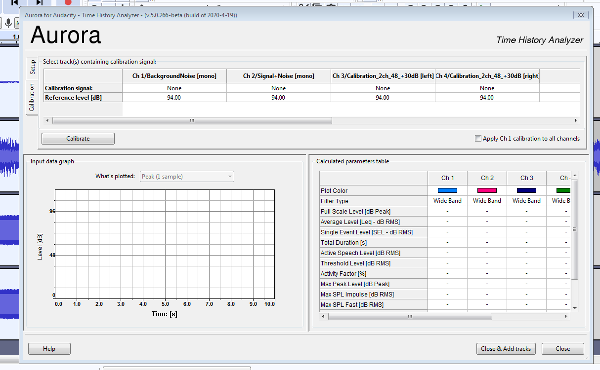
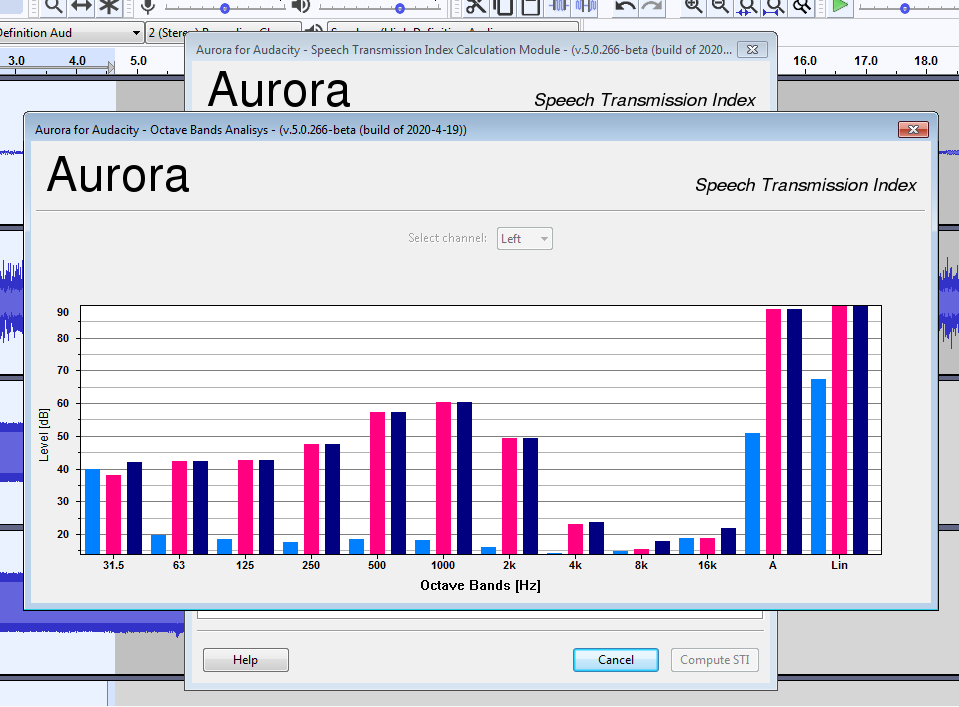

Load all the traces to be analyzed into the workspace, including the one/s containing the calibration signal; select the interval you want to analyze on all the traces involved, then from the "Analyze" menu call up "Aurora Time History Analyzer..." and the module will appear as in figure 1.

The window is divided into three parts:

- in the upper part Calibration and Setup, which can be accessed by acting on the tabs on the left;

- in the lower left part the results of the analysis in graphical form

- in the lower part on the right the results in tabular form.

The first thing to do is the calibration of the full scale, which is accessed by pressing the "Calibration" tab: at this point it is necessary to associate a calibration signal to each of the traces loaded from the workspace, which appear as columns of the table. By clicking on the first box of each column (default value "None") a menu appears from which it will be possible to choose the track to be associated. Repeat the operation for each of the loaded traces (fig.2), then press the "Calibrate" button.

If the calibration signal is unique for the entire workspace (as often happens), it is possible to automatically assign it to all tracks by marking the "Apply Ch1 calibration to all channels" checkbox: in this way the calibration signal associated with the first track will be associated with all the others. If the calibration signal was produced with a level different from 94 dB, indicate the correct level in the appropriate boxes of the table.

After pressing the "Calibrate" button, a message will inform the user of the successful calibration and the values in the "Setup" table will be updated to the calculated value and colored in green (fig.3).

From the "Setup" table it is possible to choose the filters to apply to the tracks by acting on the "Select filter" line. Once the choices have been made, press the "Analyze" button and the results of the calculation will be produced both in the table and in the graph (fig.4).

It is always possible at any time to repeat the calibration or analysis procedure by making different choices.

The values in the results table can be exported by selection and using the context menu, or the common key combination Ctrl+C and copying the contents of the clipboard into a text document or spreadsheet.

When exiting the program, the calibration levels are saved and reloaded the next time the module is used.

## STI

The graphical interface of the module for calculating the *Speech Transmission Index* has been designed in such a way as to provide a guide to the user in the form of a tabbed notebook with the order of operations from left to right.

As usual for all the *Aurora for Audacity* modules, the first step always consists in loading all the tracks necessary for the calculation into the workspace, selecting the time interval to be analyzed on **all** the tracks, then calling up the "Aurora for Audacity" module STI..." from the "Tools" menu.

The interface immediately displays a note (fig.5) which illustrates to the user how to proceed with the calculation, summarizing the necessary recorded materials, so that, without proceeding further, it is possible to exit the module and prepare any missing traces.

If you have everything you need, proceed with full scale calibration by selecting the "Fullscale Calibration" tab (fig.6); from here it will be possible, using the corresponding selectors, to indicate to the module which traces contain the calibration signal, after which, by pressing the "Calibrate" button, it will be possible to proceed with the calibration procedure, the conclusion of which will be communicated to the user via a message. The operation is almost instantaneous.

If the calibration signal was generated at a level other than 94dB, use the appropriate text box to enter the correct level before starting the calibration.

Once the full scale level has been calculated (which is saved upon exiting the program and reloaded the next time it is used), you can move on to calculating the signal/noise ratio by clicking on the "SNR Calculation" tab.

The interface for calculating the ratio SN requires you to indicate to the module which traces contain the background noise of the room and which, on the other hand, contain the measurement signal possibly superimposed on the noise. As for the calibration signal, the corresponding selectors contain the list of tracks loaded from the workspace which the user will be responsible for assigning to the correct signals (fig.8).

Pressing the "Compute Levels" button will start the calculation procedure, at the end of which it will be possible to observe the calculated values both in graphic form (fig.9) and in the table on the interface. It is possible to save and retrieve the table values without executing the calculation (and therefore without loading the traces from the workspace) using the "Load/Save SPL Values" buttons. The tabulated values are also saved on exiting the module and reloaded at the next instance.

At this point you can proceed with the last step by clicking on the "Room Impulse Response" tab (fig.10) where the module requests the impulse response of the room: once the tracks have been assigned, it will be possible to calculate the Speech Transmission Index by pressing the lower right button "Compute STI".

The results of the calculation are presented both in graphical (fig.11) and tabular (fig.12) form. It is possible to export the values of the results tables by selecting and copying them to the system clipboard using the context menu, or the usual key combination Ctrl+C.

