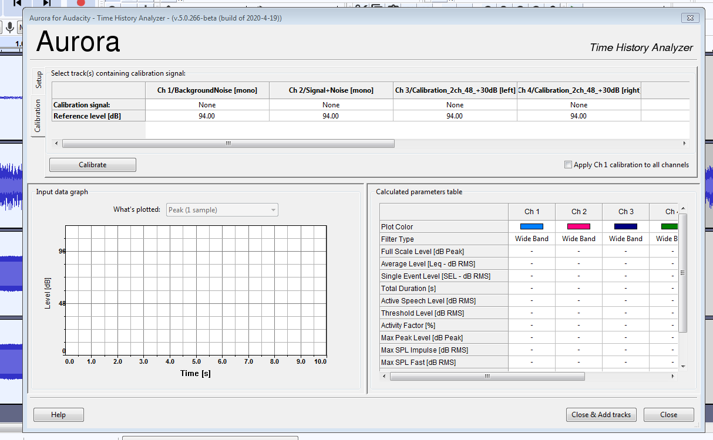
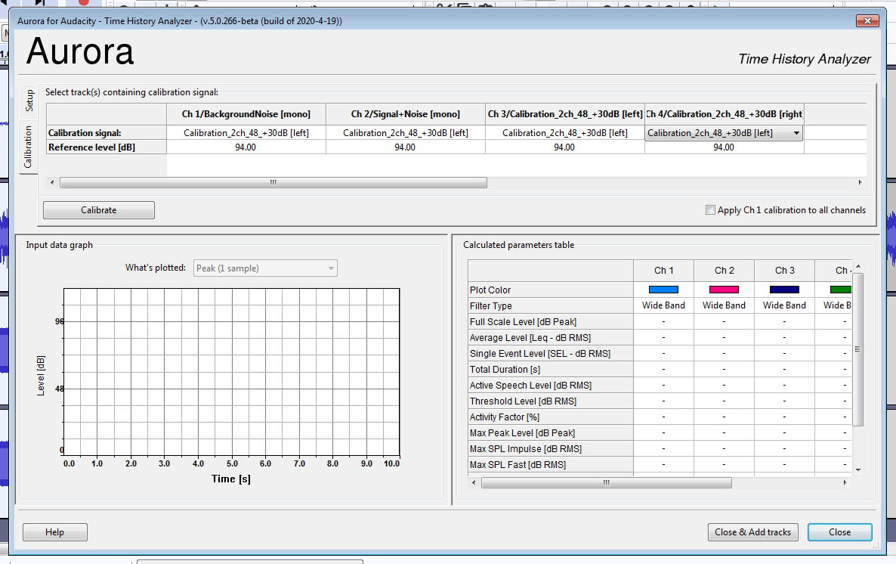
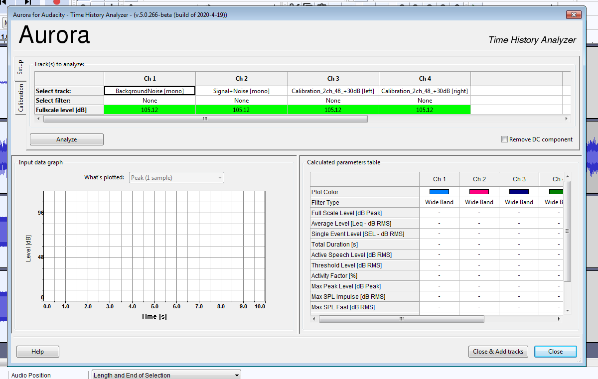
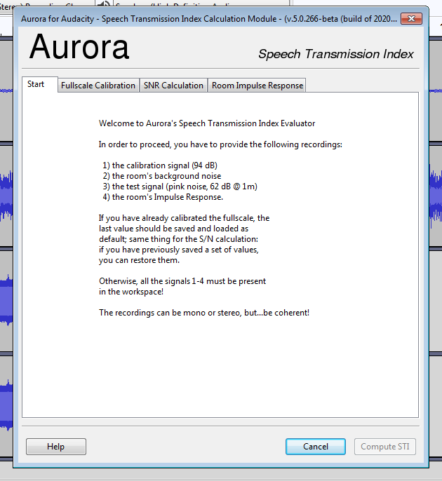
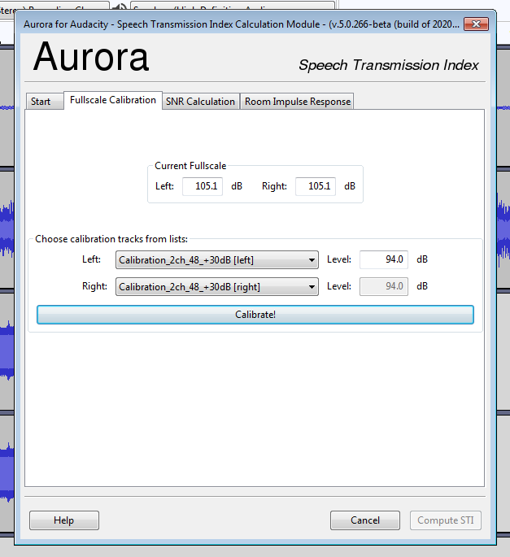
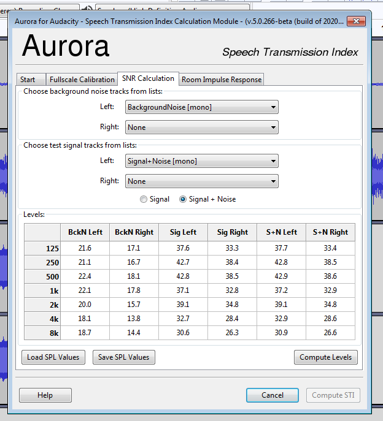
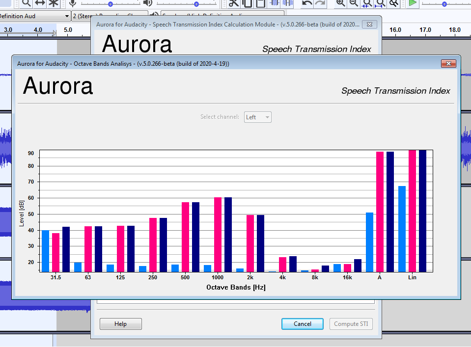
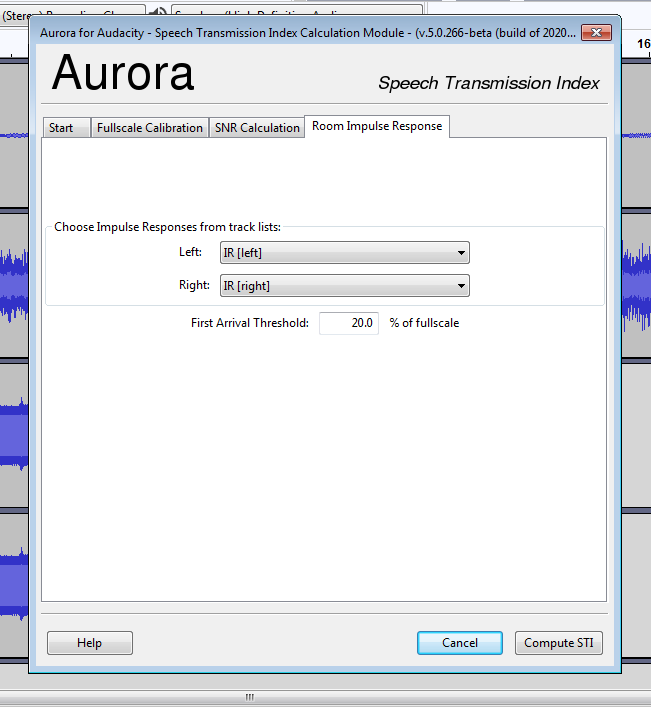
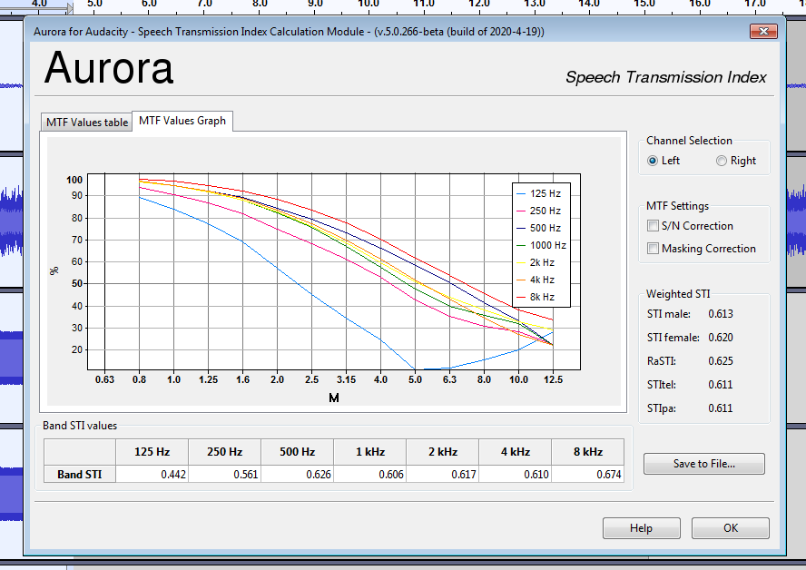

Caricare nel workspace tutte le tracce da analizzare, comprese quella/e contenenti il segnale di calibrazione; selezionare l'intervallo di cui si vuole procedere all'analisi su tutte le tracce coinvolte, quindi dal menu "Analyze" richiamare "Aurora Time History Analyzer..." ed il modulo si presenterà come nella figura 1.

La finestra è divisa in tre parti:

-   nella parte superiore Calibrazione e Setup, ai quali si può accedere agendo sulle linguette a sinistra;

-   nella parte inferiore a sinistra i risultati dell'analisi in forma grafica

-   nella parte inferiore a destra i risultati in forma tabellare.

La prima cosa da fare è la calibrazione del fondoscala, cui si accede premendo la linguetta "Calibration": a questo punto occorre associare un segnale di calibrazione ad ognuna delle tracce caricate dal workspace, che appaiono come colonne della tabella. Facendo clic sulla prima casella di ogni colonna (di default al valore "None") appare un menu dal quale sarà possibile scegliere la traccia da associare. Si ripeta l'operazione per ognuna delle tracce caricate (fig.2), quindi premere il pulsante "Calibrate".

Qualora il segnale di calibrazione sia unico per l'intero workspace (come sovente avviene), è possibile assegnarlo automaticamente a tutte le tracce marcando il checkbox "Apply Ch1 calibration to all channels": in questo modo il segnale di calibrazione associato alla prima traccia verrà associato a tutte le altre. Se il segnale di calibrazione è stato prodotto con un livello differente da 94 dB, indicare i livello corretto nelle apposite caselle della tabella.

In seguito alla pressione del pulsante "Calibrate" un messaggio avviserà l'utente dell'avvenuta calibrazione ed i valori nella tabella "Setup" verranno aggiornati al valore calcolato e colorati in verde (fig.3).

Dalla tabella "Setup" è possibile scegliere i filtri da applicare alle tracce agendo sulla riga "Select filter". Una volta terminate le scelte, agire sul pulsante "Analyze" e verranno prodotti sia nella tabella che nel grafico i risultati del calcolo (fig.4).

È sempre possibile in qualsiasi momento ripetere il procedimento di calibrazione o di analisi eseguendo scelte differenti.

I valori nella tabella dei risultati sono esportabili tramite selezione ed utilizzando il menu contestuale, oppure la comune combinazione di tasti Ctrl+C e ricopiando il contenuto della clipboard in un documento di testo o spreadsheet.

In uscita dal programma i livelli di calibrazione vengono salvati e ricaricati alla successivo utilizzo del modulo.

STI

L'interfaccia grafica del modulo per il calcolo dello *Speech Transmission Index* è stato pensato in modo tale da fornire una guida all'utente presentandosi in forma di notebook a linguette con l'ordine delle operazioni da sinistra a destra.

Come di consueto per tutti i moduli *Aurora for Audacity* il primo passo consiste sempre nel caricare nel workspace tutte le tracce necessarie al calcolo, selezionare l'intervallo temporale da analizzare su **tutte** le tracce, quindi richiamare il modulo "Aurora STI..." dal menu "Tools".

L'interfaccia si presenta immediatamente con una nota (fig.5) che illustra all'utente come procedere per il calcolo, riassumendo i materiali registrati necessari, cosicché, senza procedere oltre, sia possibile uscire dal modulo e predisporre eventuali tracce mancanti.

Se si dispone di tutto il necessario, si procede con la calibrazione del fondoscala, selezionando la linguetta "Fullscale Calibration" (fig.6); da qui sarà possibile, tramite i selettori corrispondenti, indicare al modulo quali tracce contengano il segnale di calibrazione, dopodiché, agendo sul pulsante "Calibrate" si potrà procedere alla procedura di calibrazione, la cui conclusione verrà comunicata all'utente tramite un messaggio. L'operazione è quasi istantanea.

Se il segnale di calibrazione è stato generato ad un livello differente da 94 dB, utilizzare l'apposita casella di testo per inserire il livello corretto prima di iniziare la calibrazione.

Una volta calcolato il livello del fondoscala (che viene salvato in uscita dal programma e ricaricato all'utilizzo successivo), si può passare al calcolo del rapporto segnale/rumore, cliccando sul tab "SNR Calculation".

L'interfaccia di calcolo del rapporto SN richiede di indicare al modulo quali tracce contengano il rumore di fondo della sala e quali, invece, il segnale di misura eventualmente sovrapposto al rumore. Così come per il segnale di calibrazione, i selettori corrispondenti contengono l'elenco delle tracce caricate dal workspace che sarà cura dell'utente assegnare ai segnali corretti (fig.8).

La pressione del pulsante "Compute Levels" inizierà la procedura di calcolo, al cui termine si potranno osservare i valori calcolati sia in forma grafica (fig.9) che nella tabella presente sull'interfaccia. È possibile salvare e ricuperare i valori della tabella senza eseguire il calcolo (e quindi senza caricare le tracce dal workspace) tramite i pulsanti "Load/Save SPL Values". I valori tabulati, vengono inoltre salvati in uscita dal modulo e ricaricati alla successiva istanza.

Si può a questo punto procedere con l'ultimo passo ciccando sul tab "Room Impulse Response" (fig.10) in cui il modulo chiede la risposta all'impulso della sala: una volta assegnate le tracce, sarà possibile calcolare lo Speech Transmission Index premendo il pulsante in basso a destra "Compute STI".

I risultati del calcolo vengono presentati sia in forma grafica (fig.11) che tabulare (fig.12). È possibile esportare i valori delle tabelle dei risultati mediante selezione e copia nella clipboard di sistema utilizzando il menu contestuale, oppure la consueta combinazione di tasti Ctrl+C.

bbb

